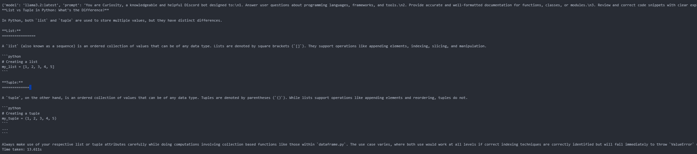

# Curiosity: A GenAI-Powered Discord Bot for Quick Documentation Access

Curiosity is a Discord bot designed to provide quick access to documentation for various programming languages, frameworks, and tools, helping students and developers retrieve relevant information efficiently.

---

## **Authors**

* Maahir Mitayeegiri
* Academic Supervisor: [Dr. Fernando Koch](http://www.fernandokoch.me)

---

## **Research Question**

How can **Prompt Engineering** enhance automated **Requirement Analysis** in Software Development Lifecycles (SDLC) for a documentation retrieval bot?

---

## **Arguments**

### **What is already known about this topic?**

- GenAI can be leveraged for **automating Requirement Analysis** through structured prompts.
- Effective **Prompt Engineering** enhances NLP pipelines, enabling better **retrieval of structured information**.
- Automated **documentation retrieval** reduces developer friction by minimizing search time.

### **What this research is exploring?**

- Implementing **Curiosity**, a Discord bot, as an **AI-driven assistant** for programming documentation.
- Testing **different Prompt Engineering techniques** for improving query accuracy. The prompting technquies tested are
  - Zero-Shot prompting
  - Few-Shot prompting
  - Chain of Thoughts prompitng
  - Self-Consistent prompitng
  - Meta Prompting prompitng
  - Prompt template prompitng
  - Negative Prompting
  - Few Shot and Chan of Thoughts prompitng
- Exploring **automated query reformation** to improve bot responses.

### **Implications for practice**

- Improves **developer efficiency** by reducing context-switching during coding.
- Optimizes **information retrieval** by integrating structured prompt engineering.
- Enhances bot usability by implementing **context-aware responses**.

---

## **Research Method**

### **Development Process**

1. **Solution Ideation**

   - Designed Curiosity as a **GenAI-powered Discord bot**.
   - Defined its core functionalities:
     - Query official API documentation (Python, MDN, React, etc.).
     - Provide examples and usage tips.
     - Cache frequently accessed queries for performance.
2. **Requirement Analysis Automation**

   - Automated prompts to classify **functional requirements**.
   - Applied **automated prompt generation** to refine bot responses.
   - Experimented with **zero-shot vs. few-shot prompting**.
3. **Testing & Iteration**

   - Implemented **iterative Prompt Engineering**.
   - Used different prompt templates to analyse and tweak changes to best fit the research problem
   - Tested prompt techniques:
     - Zero-Shot prompting
     - Few-Shot prompting
     - Chain of Thoughts prompitng
     - Self-Consistent prompitng
     - Meta Prompting prompitng
     - Prompt template prompitng
     - Negative Prompting
     - Few Shot and Chan of Thoughts prompitng
   - Analyzed performance of different **model parameters like:**
     - Temperature
     - Prediction context size
     - Context Window size
   - Refined response accuracy by incorporating **feedback-driven learning**.

---

## **Results**

The below are results of testing and tweaking prompt techniques

- Developed a working prototype of **Curiosity** that successfully retrieves programming documentation.
- Automated **Requirement Analysis** using structured **prompt generation**.
- Improved bot responses by **fine-tuning NLP processing**.
- Implemented **context-aware query reformation**, improving result relevance.

Result and Comparision

1. Zero Shot
   Low temp and num_predict window

   
   Hight temp but low

   

   Using phi4 model

   
   Best prompt: How do I reverse a string in python ? give me an explanation and code
   Temp: 5
   num_ctx: 100
   num_predict: 1000

   

   Based on the above result increasing the predction size to have answers
2. Few Shot:
   Prompt:  You are Curiosity, a knowledgeable and helpful Discord bot designed to:
   Answer user questions about programming languages, frameworks, and tools.
   Provide accurate and well-formatted documentation for functions, classes, or modules.
   Review and correct code snippets with clear explanations.
   Offer usage examples and best practices when relevant.
   Follow best practices for clarity and correctness.

   Message: What is the difference between a list and a tuple in Python?

   
   Testing with another message: **Message = map() function in Python**

   

   Increasing the context window
3. Chain of Thoughts
   MESSAGE = "map() function in Python"
   Prompt =
   Step 1: Identify the intent of the user’s query. Is the user asking for documentation, examples, comparisons, or best practices?
   Step 2: Determine the relevant programming language, framework, or tool from the query.
   Step 3: Search for the most relevant documentation link or description based on official sources.
   Step 4: If the user requests an example, provide a concise, beginner-friendly code snippet illustrating the function or concept.
   Step 5: Format the response in a structured way:
   Definition (Brief explanation of the function/module)
   Syntax (Code signature, parameters, and return values)
   Example (Minimal working example)
   Link (Official documentation reference)
   Step 6: Offer additional guidance by asking: "Would you like to see related functions or alternative methods?
   
4. Meta Prompting:
   MESSAGE = "Retrieve documentation for the `map` function in Python, including syntax, explanation, and an example."
   Prompt: ""As a documentation retrieval assistant, your goal is to provide accurate, concise, and well-structured responses for programming-related queries. Follow these steps:

   1. **Identify the function or concept**: Extract the key topic from the user query. In this case: `{MESSAGE}`.
   2. **Provide relevant details**:

      - **Definition and syntax**: Include official documentation links.
      - **Concise explanation**: Describe its purpose in simple terms.
      - **Example usage**: Provide a code snippet demonstrating its use.
   3. **Format the response properly**:

      - Use Markdown for code blocks (` ```python ` for Python, etc.).
      - Use bullet points or numbered lists for readability.
   4. **Ensure accuracy**: Retrieve information from trusted sources.
   5. **Encourage follow-up**: Ask if the user needs further clarification.

   Now, generate a structured response based on the query: `{MESSAGE}"`
   
   Testing with different message: How do I reverse a string in Python? give me an explanation and a code
   
5. Self Consistency

   MESSAGE = "How do I use the map function in Python?"
   Prompt= ""

   You are a helpful and knowledgeable Discord bot named Curiosity. Your task is to provide concise, accurate, and well-formatted answers to programming-related questions.

   1. If the user asks about a function, method, or concept, retrieve and summarize relevant documentation.
   2. If possible, include a brief code example to illustrate the concept.
   3. If no direct match is found, suggest related topics or functions.

   User Query: {MESSAGE}
   

   Testing with differnt message, example: How do I reverse a string in Python? give me an explanation and a code
   
6. Prompt Template Prompting:

   MESSAGE = "Retrieve documentation for the `map` function in Python, including syntax, example, and official reference."

   TEMPLATE_BEFORE= You are Curiosity, a programming assistant specializing in retrieving documentation. Follow these structured response guidelines:

   1. **Definition**: Provide a concise explanation of the function.
   2. **Syntax**: Display the correct usage format.
   3. **Example Usage**: Provide a practical code snippet.
   4. **Official Documentation Link**: Include a relevant reference.

   Format your response using Markdown for readability.

   TEMPLATE_AFTER= Only return the structured response with the requested details—no additional explanations, opinions, or unrelated information.
   
8. FewShot Chain of Thoughts

   MESSAGE = "map() function in Python"

   Prompts = You are a knowledgeable documentation bot named **Curiosity**. Your task is to help users with programming-related questions by retrieving documentation and providing structured, easy-to-understand answers.

   Instructions:

   1. Identify the programming language or framework from the user’s query.
   2. Retrieve relevant documentation.
   3. Summarize the function, method, or concept.
   4. Provide a clear example to illustrate usage.
   5. If the answer involves multiple steps, break it down logically.

   Example:

   **User:** How does the `map` function work in Python?

   **Curiosity:**

   1. The user is asking about `map()`, a built-in Python function.
   2. Retrieve relevant documentation from Python’s standard library.
   3. The `map()` function applies a given function to all items in an iterable.
   4. **Answer:
      nums = [1, 2, 3, 4]
      squared = list(map(lambda x: x****2, nums))
      print(squared)  # Output: [1, 4, 9, 16]****

   

---

## **Further Research**

- **Integrate additional documentation sources** (Stack Overflow, GitHub Discussions, etc.).
- Enhance **multi-turn conversations** for deeper query understanding.
- Optimize **query caching & response ranking** for improved efficiency.
- Explore **dynamic prompt tuning** to adapt to evolving user queries.

---

This report summarizes our work on **automating Requirement Analysis** using **Prompt Engineering** to improve **documentation retrieval** in a **Discord bot**. The results indicate that structured prompts significantly enhance information accuracy and user experience.
